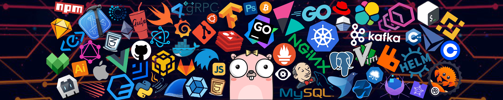

<!--  -->

<!-- <h1 align="center">Hello, I'm Mohit Prajapati</h1> -->
 

 <h1>Hi, I am 
 <a href="https://mohitpraja.netlify.com" target="_blank">Mohit Praja</a>
 
   
 </h1>

 
 
🙏🏻 Welcome to my Github profile! 
        I am a <b>Flutter developer</b> 🚀 from <b>Gwalior, India</b>. 
        I love building side projects 😍, and most of them are <b>Open source</b>. 

    

        
          
          
          <a href="https://github.com/mohitpraja" target="_blank">
        <!-- </a> -->
        <!--  -->
    

 
 

<h2> 💫 About Me: </h2>

Hello there! I am a skilled Flutter developer with a passion for crafting efficient and user-friendly mobile applications. With a strong background in mobile app development, I specialize in using the Flutter framework to create cross-platform solutions that deliver seamless and engaging user experiences. My expertise extends to designing and implementing innovative features, ensuring high performance, and maintaining code quality. Committed to staying abreast of the latest industry trends, I bring a dynamic and forward-thinking approach to every project I undertake. Let's build something incredible together!

<h2> 💻 Tech Stack: </h2>

# 📊 GitHub Stats:

 

 

### ✍️ Random Dev Quote

### 😂 Random Dev Meme

<!-- Proudly created with GPRM ( https://gprm.itsvg.in ) -->
