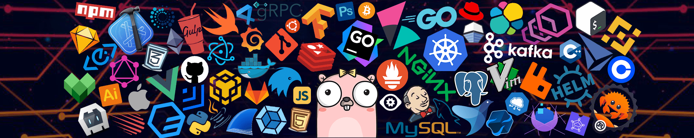

  <h1>
    Hi, I'm <a href="https://mohitpraja.netlify.app" target="_blank">Mohit Praja</a>
    
  </h1>

  
  
  

    🙏🏻 Welcome to my GitHub profile! 
    I am a <b>Flutter Developer</b> 🚀 from <b>Gwalior, India</b>. 
    I love building side projects 😍, and most of them are <b>Open Source</b>.
  

  

    
    
    
    
    
  

 
 

## 💫 About Me

Hello! I'm a passionate and skilled **Flutter developer** with expertise in crafting efficient, user-friendly mobile applications. With a strong background in mobile app development, I specialize in using Flutter and Dart to build scalable, high-performance applications for both Android and iOS platforms.

- 🌱&nbsp;&nbsp;&nbsp;I'm currently learning **Web Development**
- 🔭&nbsp;&nbsp;&nbsp;I'm exploring **Machine Learning** and AI applications
- 💡&nbsp;&nbsp;&nbsp;I'm interested in **cross-platform development** and **backend integration**
- 📫&nbsp;&nbsp;&nbsp;Ask me about **PC Building**, **Movies**, **Mobile Development**, or anything tech-related!
- ⚡&nbsp;&nbsp;&nbsp;Fun fact: The first rule of programming — if it works, don't touch it! 🤓

 
 

## 💻 Tech Stack

   
   
   
   
   
   
   
   
   
   
   
   
   
   
   
   
   
  

 

## 📊 GitHub Statistics

   
  
  
  
   
   
  

 

## 🤝 Let's Connect!

I'm always open to collaborating on interesting projects, discussing new ideas, or helping with mobile app development. Feel free to reach out!

  

---

  
<b>Made with ❤️ by Mohit Praja</b>

